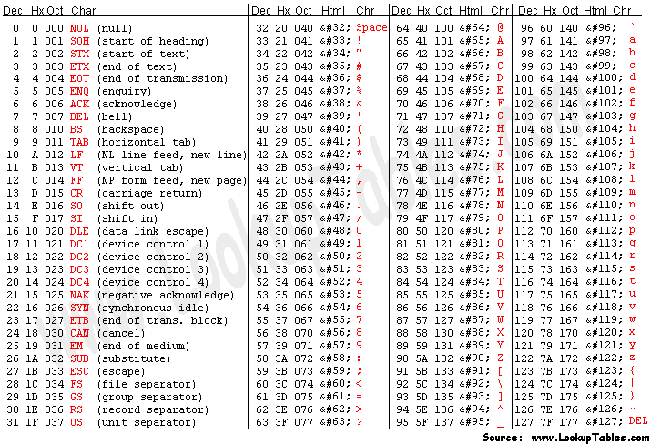

# ASCII - American Standard Code for Information Interchange

> A character encoding standard that assigns numerical values to characters.

<p align="center">
  
</p>

---

## Table of Contents

- [What is ASCII?](#what-is-ascii)
- [Why ASCII Exists](#why-ascii-exists)
- [How ASCII Works](#how-ascii-works)
- [7-Bit Representation](#7-bit-representation)
- [ASCII Range](#ascii-range)
- [Control Characters](#control-characters)
- [Printable Characters](#printable-characters)
- [Letters](#letters)
- [Digits](#digits)
- [Symbols](#symbols)
- [Space](#space)
- [Decimal Representation](#decimal-representation)
- [Hexadecimal Representation](#hexadecimal-representation)
- [Binary Representation](#binary-representation)
- [Character vs Number](#character-vs-number)
- [ASCII Arithmetic](#ascii-arithmetic)
- [ASCII in C](#ascii-in-c)
- [ASCII in JavaScript](#ascii-in-javascript)
- [ASCII and Text](#ascii-and-text)
- [ASCII and Hex Dumps](#ascii-and-hex-dumps)
- [Important Values to Remember](#important-values-to-remember)
- [Useful Commands](#useful-commands)
- [Key Takeaways](#key-takeaways)

---

# What is ASCII?

**ASCII** stands for:

> **American Standard Code for Information Interchange**

ASCII is a standard that assigns a numerical value to a set of characters.

For example:

```text
A → 65
B → 66
C → 67

a → 97
b → 98
c → 99

0 → 48
1 → 49
2 → 50
```

Instead of treating a character only as a symbol, ASCII gives it a numerical representation.

For example:

```text
A
↓
65
```

---

# Why ASCII Exists

Computers work with numerical data, while humans work with characters.

Humans see:

```text
Hello
```

ASCII gives each character a numerical value:

```text
H → 72
e → 101
l → 108
l → 108
o → 111
```

Therefore:

```text
Hello
```

can be represented as:

```text
72 101 108 108 111
```

ASCII provides a common mapping between characters and numbers.

---

# How ASCII Works

ASCII maps characters to values from:

```text
0 → 127
```

For example:

```text
Character     Decimal

A             65
B             66
C             67
```

The number can then be represented in different forms.

For example:

```text
A
│
├── Decimal      65
├── Hexadecimal  0x41
└── Binary       01000001
```

These are different representations of the same numerical value.

---

# 7-Bit Representation

Standard ASCII uses **7 bits**.

A bit can contain:

```text
0
```

or:

```text
1
```

With 7 bits:

```text
2⁷ = 128
```

Therefore, ASCII has:

```text
128 possible values
```

The values are:

```text
0 → 127
```

---

# ASCII Range

The ASCII range can be divided into:

```text
0 ─────────────── 31
│
│ Control Characters
│
32 ────────────── 126
│
│ Printable Characters
│
127
│
└── DEL
```

| Range | Description |
|---:|---|
| `0–31` | Control characters |
| `32–126` | Printable characters |
| `127` | DEL |

---

# Control Characters

Control characters are ASCII values that represent control functions rather than visible characters.

Important values:

| Decimal | Hex | Name |
|---:|---:|---|
| `0` | `0x00` | NUL |
| `7` | `0x07` | BEL |
| `8` | `0x08` | BS |
| `9` | `0x09` | TAB |
| `10` | `0x0A` | LF |
| `11` | `0x0B` | VT |
| `12` | `0x0C` | FF |
| `13` | `0x0D` | CR |
| `27` | `0x1B` | ESC |
| `127` | `0x7F` | DEL |

The most commonly encountered ones are:

```text
TAB → 9
LF  → 10
CR  → 13
ESC → 27
```

---

## TAB

```text
TAB → 9 → 0x09
```

Often represented in programming as:

```text
\t
```

---

## Line Feed

```text
LF → 10 → 0x0A
```

Often represented as:

```text
\n
```

---

## Carriage Return

```text
CR → 13 → 0x0D
```

Often represented as:

```text
\r
```

---

# Printable Characters

Printable ASCII characters range from:

```text
32 → 126
```

They include:

```text
Space
Letters
Digits
Punctuation
Symbols
```

Examples:

```text
Space → 32
!     → 33
A     → 65
a     → 97
0     → 48
```

---

# Letters

## Uppercase

Uppercase letters range from:

```text
A → Z
```

Their ASCII values are:

```text
65 → 90
```

Examples:

```text
A → 65
B → 66
C → 67
D → 68
...
Z → 90
```

---

## Lowercase

Lowercase letters range from:

```text
a → z
```

Their ASCII values are:

```text
97 → 122
```

Examples:

```text
a → 97
b → 98
c → 99
d → 100
...
z → 122
```

---

# Digits

The characters `0` through `9` have consecutive ASCII values.

```text
'0' → 48
'1' → 49
'2' → 50
'3' → 51
'4' → 52
'5' → 53
'6' → 54
'7' → 55
'8' → 56
'9' → 57
```

Therefore:

```text
'0' → 48
'9' → 57
```

---

# Symbols

ASCII also contains punctuation and symbols.

Examples:

```text
! → 33
" → 34
# → 35
$ → 36
% → 37
& → 38
' → 39
( → 40
) → 41
* → 42
+ → 43
, → 44
- → 45
. → 46
/ → 47
```

Other important values:

```text
: → 58
; → 59
< → 60
= → 61
> → 62
? → 63
@ → 64
```

---

# Space

The space character has the ASCII value:

```text
Space → 32
```

Hexadecimal:

```text
Space → 0x20
```

Binary:

```text
Space → 00100000
```

This is important when reading raw bytes.

For example:

```text
47 45 54 20 2F
```

Here:

```text
47 → G
45 → E
54 → T
20 → Space
2F → /
```

Therefore:

```text
47 45 54 20 2F
```

represents:

```text
GET /
```

> **Important:** `47`, `45`, `54`, `20`, and `2F` in this example are hexadecimal values.

---

# Decimal Representation

ASCII values are commonly written in decimal.

For example:

```text
A → 65
B → 66
C → 67
```

The word:

```text
ABC
```

becomes:

```text
65 66 67
```

---

# Hexadecimal Representation

ASCII values are frequently written in hexadecimal.

For example:

```text
A → 0x41
B → 0x42
C → 0x43
```

Therefore:

```text
ABC
```

becomes:

```text
41 42 43
```

When looking at a hexadecimal representation, remember:

```text
0x41 ≠ decimal 41
```

`0x41` means hexadecimal `41`.

Its decimal value is:

```text
0x41 = 65
```

---

# Binary Representation

ASCII values can also be represented using binary.

For example:

```text
A → 65 → 01000001
```

```text
B → 66 → 01000010
```

```text
C → 67 → 01000011
```

Therefore:

```text
ABC
```

can be represented as:

```text
01000001 01000010 01000011
```

---

# Character vs Number

This is an important concept when programming.

These are different:

```text
'A'
```

and:

```text
65
```

`'A'` is a character.

`65` is a number.

ASCII defines:

```text
'A' → 65
```

Another important example:

```text
'0'
```

is not:

```text
0
```

Instead:

```text
'0' → 48
```

So:

```text
'0' ≠ 0
```

---

# ASCII Arithmetic

ASCII characters have numerical values, so arithmetic can be performed on them.

For example:

```text
'A' → 65
```

Adding `1`:

```text
65 + 1 = 66
```

And:

```text
66 → 'B'
```

Therefore:

```text
'A' + 1 → 'B'
```

This is why you can use ASCII values to move between letters.

For example:

```text
'A' + 2 → 'C'
```

and:

```text
'a' + 2 → 'c'
```

---

# ASCII in C

C makes the relationship between characters and numbers very visible.

```c
#include <stdio.h>

int main(void)
{
    char c = 'A';

    printf("Character: %c\n", c);
    printf("ASCII value: %d\n", c);

    return 0;
}
```

Output:

```text
Character: A
ASCII value: 65
```

The important format specifiers are:

```text
%c → character
%d → decimal integer
```

You can also use:

```c
printf("%d\n", 'A');
```

Output:

```text
65
```

---

# ASCII in JavaScript

JavaScript provides methods for converting between characters and character codes.

## Character → Code

```javascript
let c = 'A';

console.log(c.charCodeAt(0));
```

Output:

```text
65
```

---

## Code → Character

```javascript
console.log(String.fromCharCode(65));
```

Output:

```text
A
```

The relationship is:

```text
'A'
 ↓
charCodeAt()
 ↓
65
```

And:

```text
65
 ↓
fromCharCode()
 ↓
'A'
```

---

# ASCII and Text

A text string is made of characters.

For example:

```text
Hello
```

contains:

```text
H
e
l
l
o
```

Their ASCII values are:

```text
H → 72
e → 101
l → 108
l → 108
o → 111
```

Therefore:

```text
Hello
```

can be represented as:

```text
72 101 108 108 111
```

Or in hexadecimal:

```text
48 65 6C 6C 6F
```

Or in binary:

```text
01001000
01100101
01101100
01101100
01101111
```

---

# ASCII and Hex Dumps

A hex dump displays the raw bytes of data using hexadecimal notation.

For example:

```bash
xxd file.txt
```

If the file contains:

```text
Hello
```

you may see:

```text
00000000: 4865 6c6c 6f
```

Breaking it down:

```text
48 → H
65 → e
6c → l
6c → l
6f → o
```

Therefore:

```text
48 65 6c 6c 6f
```

means:

```text
Hello
```

This is one of the most useful practical applications of ASCII.

---

# Important Values to Remember

You don't need to memorize the entire ASCII table.

These values are especially useful:

```text
Space → 32
```

```text
'0' → 48
'9' → 57
```

```text
'A' → 65
'Z' → 90
```

```text
'a' → 97
'z' → 122
```

Control characters:

```text
TAB → 9
LF  → 10
CR  → 13
ESC → 27
```

---

# Useful Commands

Linux provides several useful commands for working with ASCII and raw data.

## Display the ASCII table

```bash
man ascii
```

## Hex dump

```bash
xxd file
```

## Hex dump with ASCII representation

```bash
hexdump -C file
```

## Display bytes

```bash
od -An -tx1 file
```

---

# Key Takeaways

- ASCII stands for **American Standard Code for Information Interchange**.
- Standard ASCII uses **7 bits**.
- ASCII contains **128 values**.
- The range is `0–127`.
- `0–31` are mainly control characters.
- `32–126` are printable characters.
- `127` is `DEL`.
- `'A'` → `65`.
- `'a'` → `97`.
- `'0'` → `48`.
- Space → `32`.
- ASCII values can be represented in decimal, hexadecimal, or binary.
- `'0'` and `0` are different.
- `47` decimal is `/`.
- `0x47` hexadecimal is `G`.
- ASCII characters have numerical values, which makes arithmetic possible.
- ASCII is commonly encountered when inspecting text and raw byte representations.

---

# Final Mental Model

The most important thing to remember is:

```text
Character
    ↓
ASCII value
    ↓
Number
```

For example:

```text
A
│
├── Decimal
│     ↓
│     65
│
├── Hexadecimal
│     ↓
│     0x41
│
└── Binary
      ↓
      01000001
```

Or:

```text
"GET /"
```

can be represented in hexadecimal as:

```text
47 45 54 20 2F
```

Where:

```text
47 → G
45 → E
54 → T
20 → Space
2F → /
```

> **ASCII is a mapping between characters and numerical values.**